# n8n Multi-Agent RAG System

A sophisticated multi-agent Retrieval-Augmented Generation system for the New Zealand Building Code, built entirely in n8n. Each specialized agent handles specific code sections with dedicated vector stores, while an orchestration layer intelligently routes queries for accurate, code-compliant responses.

## 📊 System Architecture Diagrams

### Code Orchestration Agent Workflow

```mermaid
graph TD
    A["🔔 Chat Trigger<br/>When message received<br/>Webhook endpoint"] --> ORCH["🧠 Orchestration Agent<br/>GPT-4.1 Main Controller<br/>Query analysis & routing"]
    
    B["🤖 OpenAI GPT-4.1<br/>Language Model<br/>Temperature: 0.4"] --> ORCH
    C["💾 PostgreSQL Memory<br/>Chat History Storage<br/>Table: orch_agent_history"] --> ORCH
    
    ORCH --> D["🏗️ Code-B Tool<br/>Stability & Durability<br/>Structural integrity, loads,<br/>seismic, materials"]
    ORCH --> E["🔥 Code-C Tool<br/>Protection from Fire<br/>Fire prevention, spread,<br/>evacuation, firefighting"]
    ORCH --> F["♿ Code-D Tool<br/>Access Routes<br/>Accessibility, movement,<br/>disabilities, lifts"]
    ORCH --> G["💧 Code-E Tool<br/>Moisture Management<br/>Surface water, external,<br/>internal moisture"]
    ORCH --> H["🛡️ Code-F Tool<br/>Safety of Users<br/>Hazards, falling, warnings,<br/>emergency systems"]
    ORCH --> I["🔧 Code-G Tool<br/>Services & Facilities<br/>Hygiene, ventilation,<br/>utilities, lighting"]
    ORCH --> J["🌡️ Code-H Tool<br/>Energy Efficiency<br/>Thermal resistance,<br/>HVAC, hot water"]
    
    D --> D1["🔍 Code-B Agent<br/>OpenAI GPT-4.1<br/>Specialized prompts"]
    E --> E1["🔍 Code-C Agent<br/>OpenAI GPT-4.1<br/>Specialized prompts"]
    F --> F1["🔍 Code-D Agent<br/>OpenAI GPT-4.1<br/>Specialized prompts"]
    G --> G1["🔍 Code-E Agent<br/>OpenAI GPT-4.1<br/>Specialized prompts"]
    H --> H1["🔍 Code-F Agent<br/>OpenAI GPT-4.1<br/>Specialized prompts"]
    I --> I1["🔍 Code-G Agent<br/>OpenAI GPT-4.1<br/>Specialized prompts"]
    J --> J1["🔍 Code-H Agent<br/>OpenAI GPT-4.1<br/>Specialized prompts"]
    
    D1 --> D2["📊 Supabase Vector Store<br/>Code-B Knowledge Base<br/>+ OpenAI Embeddings"]
    E1 --> E2["📊 Supabase Vector Store<br/>Code-C Knowledge Base<br/>+ OpenAI Embeddings"]
    F1 --> F2["📊 Supabase Vector Store<br/>Code-D Knowledge Base<br/>+ OpenAI Embeddings"]
    G1 --> G2["📊 Supabase Vector Store<br/>Code-E Knowledge Base<br/>+ OpenAI Embeddings"]
    H1 --> H2["📊 Supabase Vector Store<br/>Code-F Knowledge Base<br/>+ OpenAI Embeddings"]
    I1 --> I2["📊 Supabase Vector Store<br/>Code-G Knowledge Base<br/>+ OpenAI Embeddings"]
    J1 --> J2["📊 Supabase Vector Store<br/>Code-H Knowledge Base<br/>+ OpenAI Embeddings"]
    
    D2 --> RESP["💬 Specialized Response<br/>Building Code compliant<br/>Context-aware answer"]
    E2 --> RESP
    F2 --> RESP
    G2 --> RESP
    H2 --> RESP
    I2 --> RESP
    J2 --> RESP
```

### RAG Document Ingestion Pipeline

```mermaid
graph TD
    START["📁 Google Drive Trigger<br/>Monitor Building Code folders<br/>Auto-detect new PDFs"] --> DOC["📄 Document Detection<br/>New file uploaded<br/>Trigger processing pipeline"]
    
    DOC --> OCR["🔍 Mistral OCR Engine<br/>mistral-ocr-latest<br/>Text extraction & image annotation<br/>Bounding box processing"]
    
    OCR --> EXTRACT["📝 Content Extraction<br/>Page-by-page processing<br/>Text & image separation<br/>Metadata preservation"]
    
    EXTRACT --> SPLIT["✂️ Text Chunking<br/>LangChain RecursiveCharacterTextSplitter<br/>Context-aware splitting<br/>Optimal chunk sizes"]
    EXTRACT --> IMG["🖼️ Image Processing<br/>Supabase Storage upload<br/>Caption generation<br/>Metadata tagging"]
    
    SPLIT --> EMBED_TEXT["🔢 Text Embeddings<br/>OpenAI text-embedding-3-large<br/>High-dimensional semantic vectors<br/>1536 dimensions"]
    IMG --> EMBED_IMG["📊 Image Embeddings<br/>Caption vectorization<br/>Visual content representation<br/>Searchable image metadata"]
    
    EMBED_TEXT --> STORE_B["📊 Code-B Vector Store<br/>Stability & Durability<br/>Supabase pgvector<br/>Structural requirements"]
    EMBED_TEXT --> STORE_C["📊 Code-C Vector Store<br/>Protection from Fire<br/>Supabase pgvector<br/>Fire safety standards"]
    EMBED_TEXT --> STORE_D["📊 Code-D Vector Store<br/>Access Routes<br/>Supabase pgvector<br/>Accessibility standards"]
    EMBED_TEXT --> STORE_E["📊 Code-E Vector Store<br/>Moisture Management<br/>Supabase pgvector<br/>Water protection"]
    EMBED_TEXT --> STORE_F["📊 Code-F Vector Store<br/>Safety of Users<br/>Supabase pgvector<br/>User safety requirements"]
    EMBED_TEXT --> STORE_G["📊 Code-G Vector Store<br/>Services & Facilities<br/>Supabase pgvector<br/>Building services"]
    EMBED_TEXT --> STORE_H["📊 Code-H Vector Store<br/>Energy Efficiency<br/>Supabase pgvector<br/>Energy performance"]
    
    EMBED_IMG --> STORE_B
    EMBED_IMG --> STORE_C
    EMBED_IMG --> STORE_D
    EMBED_IMG --> STORE_E
    EMBED_IMG --> STORE_F
    EMBED_IMG --> STORE_G
    EMBED_IMG --> STORE_H
    
    STORE_B --> READY["✅ Knowledge Base Ready<br/>Multi-modal RAG system<br/>Text + Image vectors<br/>Section-specific expertise"]
    STORE_C --> READY
    STORE_D --> READY
    STORE_E --> READY
    STORE_F --> READY
    STORE_G --> READY
    STORE_H --> READY
    
    READY --> SYNC["🔄 Real-time Sync<br/>Google Drive monitoring<br/>Automatic updates<br/>Version control"]
    
    SYNC --> RETRIEVAL["🔍 Ready for Queries<br/>Semantic search enabled<br/>Agent tool integration<br/>Building Code expertise"]
```

## 🏗️ Project Overview

This portfolio project demonstrates a **production-grade multi-agent RAG system** specifically designed for the New Zealand Building Code. Built entirely within **n8n's visual workflow environment**, it showcases advanced knowledge retrieval architecture using specialized agents, each responsible for different code sections (B, C, D, … H).

The system features intelligent document ingestion with OCR processing, vector embeddings for semantic search, and an orchestration layer that routes user queries to the most appropriate specialist agent. This approach ensures accurate, contextual responses while maintaining separation of concerns across different regulatory domains.

## ✨ Key Capabilities

- **Multi-Agent Architecture** – Specialized agents for each Building Code section with dedicated knowledge bases and prompt-engineered expertise
- **Intelligent Query Routing** – Orchestration agent with custom prompt engineering determines the most appropriate specialist for each query
- **Advanced Image Ingestion** – Image processing that reformats text and images with annotations for vector storage, enabling LLM to render relevant images in chat responses
- **Automated Document Processing** – OCR-powered ingestion pipeline with text and image extraction, maintaining visual context
- **Vector Search & Retrieval** – Semantic search using OpenAI embeddings and Supabase vector storage for both text and image content
- **Real-Time Updates** – Google Drive integration for automatic document synchronization
- **Contextual Memory** – PostgreSQL-backed conversation memory for follow-up queries
- **Prompt-Engineered Agents** – All agents including orchestration are specifically prompt-engineered for their specialized tasks

## 🏛️ System Architecture

The system employs a sophisticated multi-layered architecture with specialized components for document ingestion, vector storage, and intelligent query routing:

### 1. Document Ingestion
Google Drive triggers detect new PDFs, triggering parallel OCR processing via Mistral.ai for text extraction and image annotation with bounding boxes.

### 2. Content Processing
Pages are split and processed, with text chunked using RecursiveCharacterTextSplitter and images uploaded to Supabase Storage with metadata preservation.

### 3. Vector Embedding
OpenAI embeddings are generated for both text chunks and image captions, stored in clause-specific Supabase vector tables for efficient retrieval.

### 4. Query Orchestration
The orchestration workflow analyzes user queries and routes them to appropriate clause agents using GPT-4.1 with conversation context preservation.

### 5. Specialized Retrieval
Each clause agent performs semantic search within its dedicated vector store, retrieving the most relevant chunks for accurate, contextual responses.

### 6. Response Generation
Retrieved context is synthesized by the specialist agent's OpenAI model to generate comprehensive, Building Code-compliant answers.

## 🤖 Specialist Agent Network

### Multi-Agent System
- **Code B Agent** - Stability & Durability: Structural integrity, load calculations, seismic requirements, and material durability standards
- **Code C Agent** - Protection from Fire: Fire safety systems, evacuation planning, sprinkler requirements, and passive fire protection
- **Code D Agent** - Access Routes: Accessibility compliance, universal design principles, lift requirements, and barrier-free access
- **Code E Agent** - Moisture Management: Waterproofing systems, vapor barriers, drainage solutions, and moisture control
- **Code F Agent** - Safety of Users: Occupational safety, hazard mitigation, fall protection, and emergency response systems
- **Code G Agent** - Services & Facilities: HVAC systems, plumbing standards, electrical safety, and building services integration
- **Code H Agent** - Energy Efficiency: Thermal performance, insulation standards, energy modeling, and sustainable building practices

### Central Orchestration Agent
- **Query Analysis Engine** - Advanced NLP analysis identifies query intent, topic domain, and complexity level using GPT-4.1
- **Context Extraction** - Extracts Building Code section references, regulatory keywords, and cross-domain dependencies
- **Multi-Agent Coordination** - Orchestrates parallel agent queries for complex cross-sectional regulatory questions
- **Response Synthesis** - Aggregates multi-agent responses with conflict resolution and coherence validation

## 📊 Technology Stack

| Layer | Technology |
|-------|-----------|
| **Orchestration** | n8n (JavaScript workflows) |
| **LLM & Embeddings** | OpenAI GPT-4.1, OpenAI Embeddings API |
| **OCR & Processing** | Mistral.ai OCR (mistral-ocr-latest) |
| **Vector Database** | Supabase Vector Store |
| **Storage** | Supabase Storage Buckets |
| **Memory** | PostgreSQL (n8n memoryPostgresChat) |
| **Document Source** | Google Drive (triggered ingestion) |
| **Code Processing** | n8n Code nodes (JS for markdown & images) |
| **Text Splitting** | LangChain RecursiveCharacterTextSplitter |
| **Deployment** | Cloud-native with auto-scaling capabilities |

## 🔧 Advanced Data Ingestion Workflows

### Multi-Modal Document Processing
- **Google Drive Trigger** - Monitors code-specific folders for PDF/image uploads with intelligent pre-processing
- **Advanced Image Ingestion & OCR** - Mistral OCR with image reformatting, text/image annotation, and vector storage optimization
- **Intelligent Chunking** - Context-aware text splitting with optimized chunk sizes and semantic overlap preservation
- **Vector Embedding** - OpenAI text-embedding-3-large generates high-dimensional semantic vectors for search
- **Supabase Storage** - Section-specific vector stores with optimized indexing and similarity search capabilities

### Technical Specifications
- **OCR Engine**: Mistral-OCR-Latest
- **Supported Formats**: PDF, Images
- **Image Annotation**: Full Metadata Preservation
- **LLM Integration**: Image Rendering in Chat
- **Health Monitoring**: Real-time Alerts
- **Rollback Capability**: Version Control

## 🧠 Memory Management System

### PostgreSQL Chat Memory
- **Session Tracking** - Maintains conversation context across multiple queries with automatic session management
- **Context Compression** - Intelligent summarization of long conversations to maintain relevant context within token limits

### Temporal Context Awareness
- **Conversation Flow** - Tracks question progression and maintains semantic coherence across related queries

## 🎯 Why This Architecture Matters

- **Scalability** – Adding new Building Code sections requires simple workflow duplication
- **Separation of Concerns** – Each agent maintains its own knowledge domain without cross-contamination
- **Extensibility** – Modular design allows easy integration of new OCR providers, LLMs, or vector databases
- **Production-Ready** – Automated monitoring and updates ensure system reliability for regulatory compliance

## 🚀 Features

### Multi-Agent System
Specialized agents for each Building Code section (B-H) with dedicated vector stores, ensuring focused expertise and preventing topic cross-contamination.

### Prompt-Engineered Agents
All agents including the orchestration layer are specifically prompt-engineered for their specialized tasks, ensuring precise, domain-expert responses with optimal reasoning patterns.

### Advanced Image Ingestion
Sophisticated image processing that reformats text and images with annotations for vector storage, enabling the LLM to render relevant images directly in chat responses with full context preservation.

### Vector Search
OpenAI embeddings with Supabase vector storage enable semantic search across both textual content and image descriptions for comprehensive retrieval.

### Intelligent Query Routing
GPT-4.1 orchestration agent with custom prompt engineering analyzes query intent and routes to the most appropriate specialist, ensuring accurate domain-specific responses.

### Conversation Memory
PostgreSQL-backed chat memory maintains context across interactions, enabling natural follow-up questions and complex query sequences.

---

*This project demonstrates advanced RAG architecture implementation using n8n's visual workflow capabilities, showcasing enterprise-grade multi-agent systems for specialized knowledge domains.*
